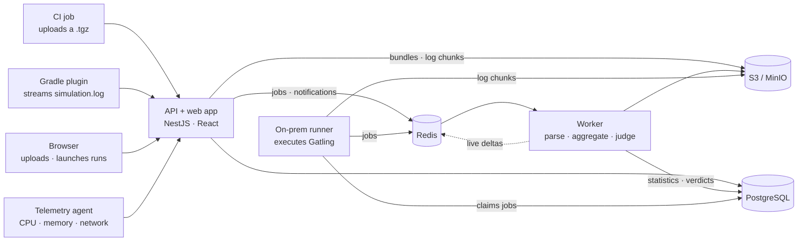

# How PerfPortal works

How the pieces fit together, and why some of them are shaped the way they
are. For using the API see [`api.md`](api.md). For running it see
[`DEPLOYMENT.md`](../DEPLOYMENT.md).

**Contents**

- [The big picture](#the-big-picture)
- [Components](#components)
- [Ingesting a finished run](#ingesting-a-finished-run)
- [Following a run live](#following-a-run-live)
- [Statistics](#statistics)
- [The worker's connection budget](#the-workers-connection-budget)
- [Security headers](#security-headers)
- [How the web app is delivered](#how-the-web-app-is-delivered)
- [Proving it matches Gatling](#proving-it-matches-gatling)
- [Names: PerfPortal and Vantrix](#names-perfportal-and-vantrix)

---

## The big picture

The on-prem runner sits inside the deployment, so it talks to the database,
object store and queue directly; jobs reach it from the UI or API through
the database. The API never parses a log. Every byte of Gatling output is read in the
worker, in its own process and event loop, so a slow parse can never slow an
API response.

---

## Components

### Apps

| App | Role |
|---|---|
| `apps/api` | NestJS on Express. Serves `/v1`, Better Auth at `/auth/*`, the OpenAPI document, the live WebSocket feed and the built web app. Accepts uploads and live chunks and writes them to object storage; it imports no parsing or aggregation code. |
| `apps/worker` | Takes queued ingest jobs, parses the bundle, runs the statistics engine and SLA evaluation, and persists the result. Also hosts the live **fold owner**, which keeps running statistics for runs that are still streaming, and the **sweeper**, which finalizes runs whose producer went silent. |
| `apps/runner` | Single-node on-prem Gatling executor. Claims one queued job at a time, launches Gatling locally (lending it a Gatling runtime when the uploaded jar carries none), tails `simulation.log` as it is written, and closes the live run into the normal pipeline. Runs the uploaded simulation under a separate Unix user. |
| `apps/web` | React 18 + Vite single-page app, using TanStack Query, ECharts, Radix UI and Tailwind CSS v4. |

### Packages

| Package | Responsibility |
|---|---|
| `@perfportal/core` | Canonical event model, run metadata, error taxonomy. No I/O. |
| `@perfportal/contracts` | Shared HTTP request/response schemas (zod), used by the API, the web app and the tests. |
| `@perfportal/plugin-gatling` | Decodes Gatling's binary `simulation.log` into canonical events, for both finished files and live streams. Pure. |
| `@perfportal/statistics` | Bucketing, DDSketch percentiles, warm-up handling, roll-ups, Gatling-assertion evaluation. Pure. |
| `@perfportal/sla` | SLA rule evaluation against statistics. Pure. |
| `@perfportal/persistence` | Prisma schema and migrations, raw-SQL repositories, metric writers and readers, Better Auth setup, the `bootstrap` script. |
| `@perfportal/storage` | S3-compatible blob store, `.tgz` bundle reading, live chunk storage. |

"Pure" packages are forbidden by a lint rule (`no-restricted-imports` in
`eslint.config.js`) from touching the filesystem, the network or the
database, so parsing and aggregation stay testable with a fixture and
nothing else.

### Outside the pnpm workspace

| Path | What it is | Toolchain |
|---|---|---|
| `clients/gatling-gradle` | The Gradle plugin that streams a run live while `gatlingRun` executes. | Kotlin, JDK 21, Gradle 8 |
| `agent` | The load-generator telemetry agent, a single static binary. | Go 1.24 |

---

## Ingesting a finished run

1. `POST /v1/runs` streams the multipart upload straight to object storage
   (it is never buffered whole in the API), records a `pending` run and
   enqueues a BullMQ job.
2. The worker claims the job, takes a per-run advisory lock, and
   decompresses the bundle into memory. That is deliberate: bundles are
   bounded by `MAX_DECOMPRESSED_BUNDLE_BYTES`, and holding the whole log
   keeps one decoder for both paths.
3. The statistics engine folds the events into per-run, per-group and
   per-request roll-ups and per-second series.
4. SLA rules (the project's, plus any scoped to the run's test) are
   evaluated, and the simulation's own Gatling assertions are decoded from
   the log and re-checked.
5. Statistics, assertions and the verdict are written in one transaction.
   The API, which has been waiting on a Postgres `LISTEN`, answers the
   original request with the verdict, or `202` if `waitMs` ran out first.

Transient failures (a database restart, an object store timeout) are retried
by the queue and leave the run at `parsing`; only a deterministic failure, or
the last attempt, marks it `failed`.

---

## Following a run live

Live bytes land in object storage, never in Redis. The worker's fold owner
reads new chunks for each `running` run, decodes them with the same decoder
the upload path uses, and publishes a delta on a timer. Redis carries only
notifications and computed deltas:

| Channel | Direction | Carries |
|---|---|---|
| `live:opened` | API → worker | a run id, when a live run opens |
| `live:advance` | API → worker | a run id, when a chunk is accepted |
| `live:closed` | API → worker | a run id, when `close` claims the run |
| `live:{runId}` | worker → API | a delta, every tick |
| `live:{runId}:deltas` | worker → replay | the same deltas, capped by a byte budget, so a late viewer catches up |

The API relays deltas to browsers over a WebSocket at `/v1/runs/{id}/live`.

- **`live:opened` and `live:advance` are optimisations.** The worker also
  polls for `running` runs, so a message lost during a deploy only delays
  folding; it never loses a run.
- **`live:closed` is not.** The pipeline that parses the closed run needs
  the same advisory lock the fold owner holds. Without the channel, the
  owner releases it a tick late, the pipeline can exhaust its retries, and
  the run waits for the sweeper.
- **A silent producer does not leave a run open.** The sweeper finalizes a
  run as `incomplete` once no chunk has arrived for `RUNNING_STALE_AFTER_MS`,
  keeping whatever whole records it received.

---

## Statistics

- **Counts, min, max and mean are exact.**
- **Percentiles come from DDSketch**, accurate to within 1% relative error,
  and are clamped to the run's own min and max so they never fall outside
  the range shown beside them.
- **Percentiles are nearest-rank.** Where a sample is small, one here can
  differ from Gatling's own report by one measurement. Both are correct; diff
  the exact columns when comparing reports.
- **A warm-up window**, configured per project, is drawn on time charts and
  excluded from summary statistics.
- **Per-second metrics are partitioned by month.** Partitions ship with
  migrations, so an instance must be upgraded at least once a year; see
  [`DEPLOYMENT.md`](../DEPLOYMENT.md#upgrading).

---

## The worker's connection budget

Each run the fold owner follows holds one Postgres connection for as long as
it owns it, because its advisory lock lives in that session. The worker
sizes its pool from the components that actually hold clients:

| Term | At defaults | Held by |
|---|---|---|
| `MAX_OWNED_RUNS` | 25 | one client per live run, for its lock's lifetime |
| fold-owner discovery | 1 | the tick's query for `running` runs |
| `WORKER_CONCURRENCY × 2` | 4 | each ingest job's lock client plus its commit |
| sweeper | 1 | one client, `BEGIN` to `COMMIT` |
| **pg pool** | **31** | |
| Prisma's own pool | 3 | `WORKER_CONCURRENCY + 1`, pinned via `connection_limit` |
| **per worker replica** | **34** | |

Two worker replicas need about 68 connections before any API replica, which
is why `infra/docker-compose.yml` raises Postgres's `max_connections` to 200.
The API's Prisma pool is not pinned; count it when sizing a production
database.

---

## Security headers

`apps/api/src/security-headers.ts` sets them on every response (the web app,
`/auth/*` and `/v1` alike) and disables `X-Powered-By`:
`Content-Security-Policy`, `X-Content-Type-Options`, `X-Frame-Options`,
`Referrer-Policy`, `Cross-Origin-Opener-Policy`,
`Cross-Origin-Resource-Policy`, `Permissions-Policy`,
`X-DNS-Prefetch-Control`, and `Strict-Transport-Security` on HTTPS requests.

- **`script-src` has no `'unsafe-inline'`.** It carries a `sha256-` hash of
  `index.html`'s inline theme script, computed at boot from the built file,
  so editing that script cannot silently break the page.
- **`style-src` does allow `'unsafe-inline'`.** ECharts writes inline styles
  on every render; the choice is that or no charts.
- **`/v1/docs` (Swagger UI) has its own, looser policy**, because hashing a
  third-party page's inline script would break on every dependency bump.
- **Behind a proxy, set `X-Forwarded-Proto: https`.** It is the only proxy
  header the API reads, and it decides only whether to send HSTS.

---

## How the web app is delivered

- **Every authenticated route is a lazy chunk.** The login page does not
  download the charts. When this landed, it took the login page from
  1,117,911 bytes of uncompressed JavaScript to 101,893 bytes over the wire.
- **Assets are precompressed at build time.** A Vite plugin writes `.br` and
  `.gz` beside each asset, and `apps/api/src/spa.ts` negotiates. Compressing
  once per build is what makes Brotli quality 11 affordable.
- **Fingerprinted assets are `immutable`; `index.html` is `no-cache`.** An
  asset URL's content can never change; `index.html` must always name the
  current fingerprints.
- **The API does not compress JSON.** Put compression for dynamic responses
  in the reverse proxy; a run's `/series` payload is not small.

---

## Proving it matches Gatling

`apps/api/test/parity.e2e.test.ts` posts Gatling's reference report bundle
over HTTP, runs the real pipeline, and asserts the statistics the fixture is
known to produce: 895 requests, 871 OK / 24 KO, max 2503 ms, mean 228 ms,
standard deviation 370 ms, indicator bands 848 / 0 / 23 / 24, and the
500/503 error counts. If ingest, persistence or serialization corrupts
anything, the numbers move.

The parity suite checks every data row of `PerfPortal_Enterprise_PRD.md`
Appendix A by name (`PT-G-*`, `PT-RQ-*`, `PT-GR-*`). One figure is easy to
misread: the fixture's true minimum response time is **16 ms**, while the
distribution chart's first bin is labelled **28**. That label is the
midpoint of the first of 100 bins, not the minimum.

---

## Names: PerfPortal and Vantrix

**PerfPortal is the product. Vantrix is the namespace of things published
outside this repository.**

| You will see | Where |
|---|---|
| `PerfPortal`, `@perfportal/*`, `PERFPORTAL_*` | The UI, the docs, the source tree and its packages, configuration. |
| `Vantrix` | The Gradle plugin id `dev.vantrix.gatling`, its Maven coordinates `dev.vantrix:gatling-gradle-plugin`, the plugin's `VANTRIX_*` variables, and the Go module path `github.com/Rabindra184/vantrix/agent`. |

The Vantrix names are coordinates other people's builds already resolve.
Renaming a plugin id breaks every `plugins { id(...) }` block written
against it, and renaming a Go module path breaks every `import`, so they
stay. New surfaces use PerfPortal.
